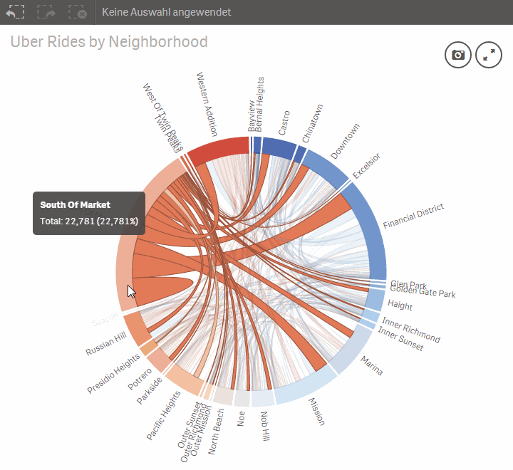
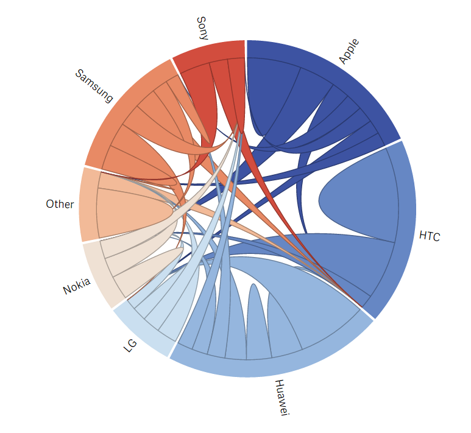

Qlik Sense Extensions Dependency Wheel
======================================

***

### Caution:

This open source Qlik Sense extension is discontinued since it became a commercial product of TIQ Solutions.

You can find a **supported version** with more features on the <a href="https://www.vizlib.com/marketplace/tiqchorddiagram">**Vizlib Marketplace**</a>.

***

This extension visualizes dependencies between two dimensions using an interactive disc. Internally, a graph data model is used. Each disc section represents a source and/or target node, and links between arcs are edges and materialize dependencies between nodes. All aggregation and rendering is done client-side in JavaScript. Built with <a href="https://github.com/mbostock/d3">d3.js</a> and Francois Zaninotto's <a href="http://fzaninotto.github.com/DependencyWheel">d3.dependencyWheels.js</a>, published with the MIT open-source license.

This extension was initially created during the 1st Qlik Hackathon at Qonnections April 2014 in Orlando.

### Dimensions:
1. Source Node Id or Name
2. Target Node Id or Name
3. Edge Id (optional, important for detailled selections)

Hint: dimensions should not contain null values

### Measures:
1. Edge KPI (additive)

### Options:
1. Color Schema
2. Aggregate Dimensions: set true when dimension used in source and target contains same members (nodes)
3. Max. Label Size: limit label length for bigger wheel rendering

### Update:

1. fixed some data aggregation issues
2. added selection capability on groups and links
3. added option to have an aggregate mode for two dimensions (usual chord chart)
4. added percentage of group and link in titles
5. sophisticated selection possibilities
6. changed selection mode to confirm for multiple selections
7. selection color feedback 

## Author

**Ralf Becher**

+ [irregular.bi](http://irregular.bi)
* [twitter/irregularbi](http://twitter.com/irregularbi)
* [github.com/ralfbecher](http://github.com/ralfbecher)

## License

Copyright © 2017 Ralf Becher

Released under the MIT license.

***
